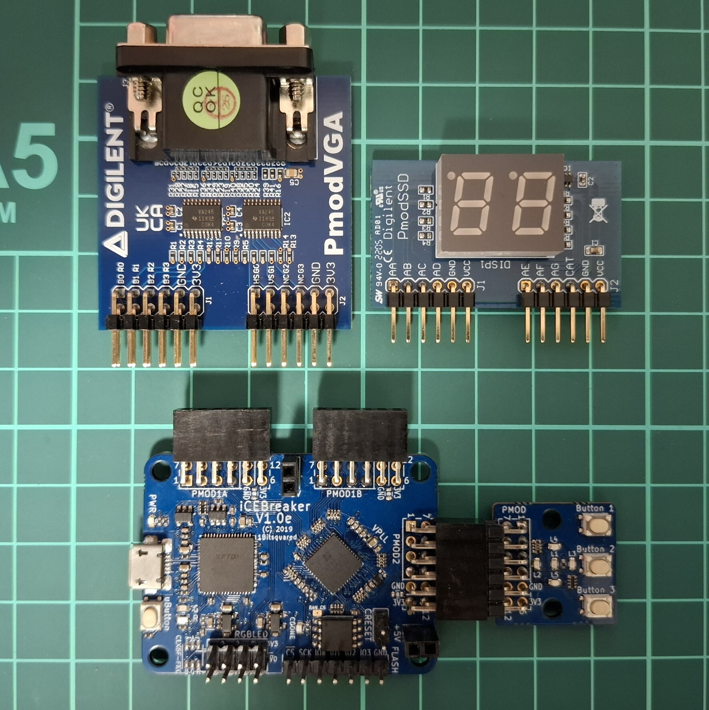
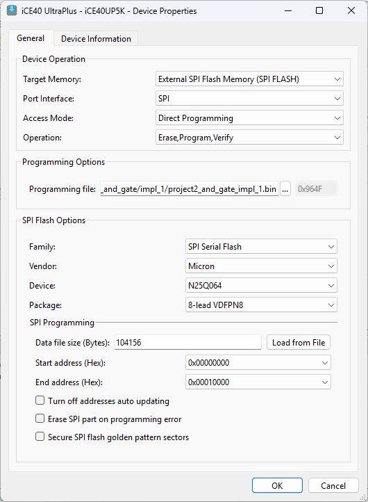

# Nandland Go Board Tutorial (iCEBreaker Board)

## About

This repository contains source code from Nandland Go Board Tutorial by Russell Merrick ([link](hhttps://nandland.com/go-board-tutorials/)).

Only the Verilog parts of the tutorial are implemented.

The code in this repository is meant to be used with the iCEBreaker FPGA v1.0e ([link](https://docs.icebreaker-fpga.org/hardware/icebreaker/))

This project uses the iCEBreaker Switches Pmod, Digilent 7-segment Display Pmod ([link](https://digilent.com/reference/pmod/pmodssd/start)), and Digilent VGA Pmod ([link](https://digilent.com/reference/pmod/pmodvga/start))

Code is implemented using Lattice Radiant 2024.2



## Contents

### Project 7: UART Part 1 - Receive Data from Computer

Send data from computer to FPGA over UART. The FPGA receives the data and displays the corresponding ASCII character code on the 7-segment display.

Use 115200 baudrate.

### Project 8: UART Part 2 - Transmit Data to Computer

Send data from computer to FPGA over UART. The FPGA receives the data and displays the corresponding ASCII character code on the 7-segment display, then send back the data to Computer.

Use 115200 baudrate.

### Project 9: VGA Introduction

Show VGA test pattern that can be selected using UART input.

Use 115200 baudrate.

### Project 10: Pong Game

Play 2 player Pong ([link](https://en.wikipedia.org/wiki/Pong)) with VGA output and button control. Game started using UART input.

Use 115200 baudrate.

# How to Program the iCEBreaker v1.0e Board

## Using Radiant Programmer (Windows)

1. In the Radiant Programmer, right-click the device entry and open Device Properties.
2. In the Device Properties, change the Target Memory to `External SPI Flash Memory (SPI FLASH)`.
3. In the SPI Flash Options, change the vendor to `Micron`, the Device to `N25Q064`, and the package to `8-lead VDFPN8`, as shown in the image below.

Now you can program the iCEBreaker v1.0e board using Radiant Programmer.



## Using iceprog (Ubuntu)

Install `iceprog`

```
sudo apt install fpga-icestorm
```

To program the bitstream, replace `<bitstream file>` with the generated bitstream:

```
iceprog <bitstream file>.bin
```

# How to use Serial Terminal

## Using MobaXterm (Windows)

- Download and Install MobaXterm
- Connect to Serial port with 115200 as baudrate

## Using tio (Ubuntu)

- Install `tio`
```
snap install tio --classic
```
- Connect to Serial port with 115200 as baudrate, replace `</dev/ttyUSB1>` with correct port.
```
tio /dev/ttyUSB1 -b 115200
```
- If you get permission error add the user into dialout group, then reboot your PC
```
sudo usermod -a -G dialout <username>
```
